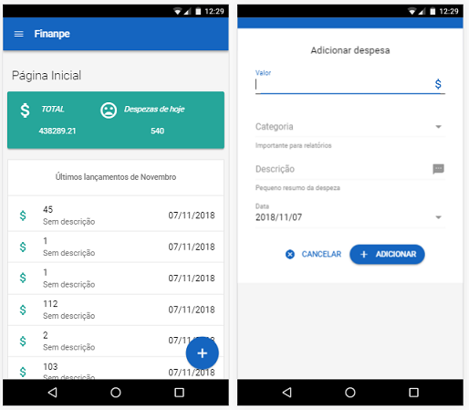
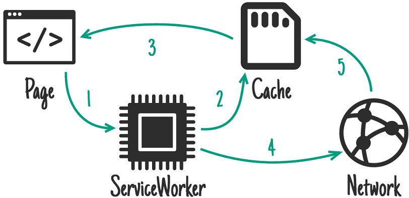

# Finanpe
### Sistema de controle financeiro e pessoal:

Ter controle sobre o orçamento ́e um enorme desafio, pois muitas pessoas não sabem o quanto gastam.  Não ́e raro também casos em que se gasta mais do que se ganha. Consequentemente, percebe-se que muitas pessoas se perdem  e,  com  planejamento  financeiro,  isso  poderia  ser  resolvido. 

### Objetivo
Este projeto propõe o desenvolvimento de um sistema web para controle financeiro, com o objetivo de fornecer uma boa experiência para os usuários, proporcionar a facilidade do uso e a reeducação financeira.

## App

### Funcionalidades Básicas
- Cadastro de despesas
- Monitoramento de Metas
- Relatório dos gastos

# Get started
Após clonar o projeto, instale as dependencias do node **(npm install)**. 

Para iniciar o modo desenvolvimento sem pwa, digite :

    quasar dev

Com PWA

    npm start

Para construir

    npm run pwa-build

## Progressive Web Apps

Este projeto foi contruido com auxilio da biblioteca [Workbox](https://developers.google.com/web/tools/workbox/), a qual disponibiliza um conjunto de boas práticas e facilita o desenvolvimento com service workers

- Precaching
- Runtime caching
- Strategies
- Request routing
- Background sync
- Helpful debugging
- Greater flexibility and feature set than sw-precache and sw-toolbox

Todos os script podem ser encontrados no diretório: 

    src-pwa
        |__ custom-service-worker.js // Implementação com api fetch e controle de cache
        |__ register-service-worker.js

#### Estratégia para get requests: *stale-while-revalidate*

O padrão "stale-while-revalidate" permite que você responda a solicitação o mais rápido possível com uma resposta armazenada em cache, se disponível, voltando para a solicitação da rede, se ela não estiver armazenada em cache. A solicitação de rede é usada para atualizar o cache.
