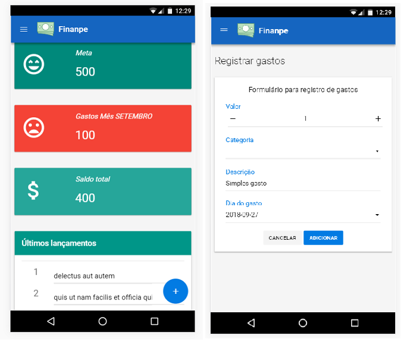

# Finanpe
### Sistema de controle financeiro e pessoal:

Ter controle sobre o orçamento ́e um enorme desafio, pois muitas pessoas não sabem o quanto gastam.  Não ́e raro também casos em que se gasta mais do que se ganha. Consequentemente, percebe-se que muitas pessoas se perdem  e,  com  planejamento  financeiro,  isso  poderia  ser  resolvido. 

### Objetivo
Este projeto propõe o desenvolvimento de um sistema web para controle financeiro, com o objetivo de fornecer uma boa experiência para os usuários, proporcionar a facilidade do uso e a reeducação financeira.

## App

### Funcionalidades Básicas
- Cadastro de despesas
- Monitoramento de Metas
- Relatório dos gastos

